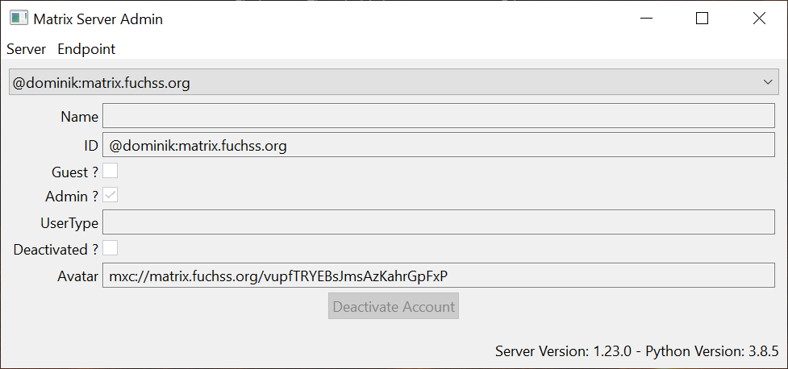
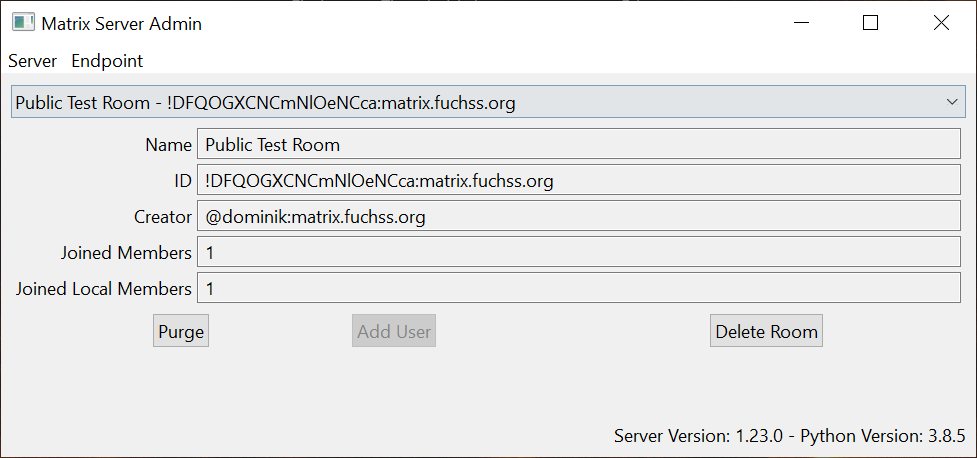
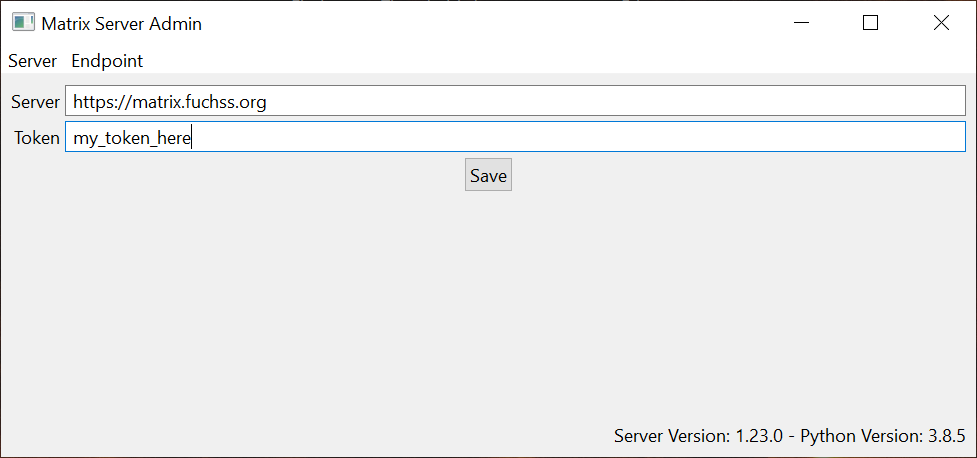

# Matrix Synapse Admin
/badge.svg)

A simple admin UI for [Synapse](https://github.com/matrix-org/synapse).
The UI contains exactly the functions I currently need for the administration of my instance of Synapse.
Especially, only parts of the [admin API](https://github.com/matrix-org/synapse/tree/master/docs/admin_api) are implemented yet.

**The project itself is still WIP. The CI currently builds only for Linux Systems**

## Current Features (the features I need so far)
* View Users & Rooms with additional information
* View Version of Synapse
* Purge & Delete Rooms

### Users

### Rooms

### Server Login

## HowTo
Currently the admin ui uses access tokens to connect to the matrix server.
To obtain the token you could eighter use the REST API of Synapse or use the access token from your client session.
(e.g. you can reveal the token of your element client in Settings -> Help & About -> Advanced).
After obtaining the token, just set the server information in the client.
